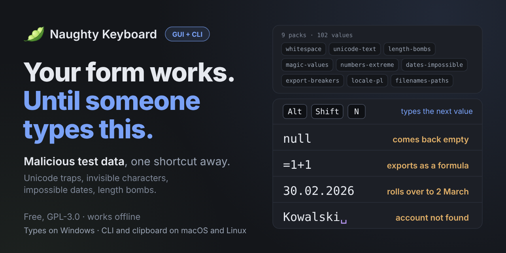

# Naughty Keyboard 🫛 - type the values that break your forms, with one shortcut

[](LICENSE)


<!--
  Badges to switch on when the thing they point at exists. Move a line out of
  this comment and it is live.

  CI, once a workflow exists:
  [](https://github.com/donislawdev/Naughty-Keyboard/actions/workflows/ci.yml)

  Latest release and downloads, once the first release is published:
  [](https://github.com/donislawdev/Naughty-Keyboard/releases/latest)
  [](https://github.com/donislawdev/Naughty-Keyboard/releases)

  Website, once there is one (put its address in place of the dots):
  [](https://...)
-->

**Naughty Keyboard** is a tool for testers and developers. One shortcut types the next awkward value
into the field in front of you: `null`, a trailing space, a zero-width space, `30.02.2026`, `=1+1`,
a name of 65 535 characters. They are the values real users and real data produce, and a form you
only ever tried with "John Smith" has never met them.

Every value comes with what it usually breaks and what a correct application does instead. When one of
them breaks something, one more shortcut copies a report block you can paste straight into a ticket.
A window and a command line, over one engine.

> **Where it works today.** Typing into other windows works on Windows. On macOS and Linux the command
> line and the pack tools work, and a value reaches a field through the clipboard.
> [Honest limits](#honest-limits) has the details.

⭐ **If it found the bug your users would have found, leave a star.** That is how the next tester who
needs it finds out it exists.



**What it can do**

- **One shortcut, one value** - `Alt+Shift+N` clears the line and types the next value of the current
  pack into whatever window has the keyboard. Previous, repeat and restart are one chord away, and
  every chord can be changed.
- **Values that explain themselves** - each one carries `breaks` (what it usually breaks, and why) and
  `expect` (what a correct application does). The pack file, `nkb show` and the report block all say so.
- **Invisible characters made visible** - the palette draws one as a marker, `␣`, instead of showing
  nothing, and counts every value four ways: graphemes, code points, bytes and UTF-16 units.
- **Mark results as you go** - works, problem or suspect, each on its own chord, with a counter of how
  far through the pack you are.
- **A bug report in one chord** - `Alt+Shift+B` copies a block for the last value: which value, from
  which version of the pack, typed as what, how large, and whether all of it arrived. The value is
  written in a form someone else can type back, never as the marker the palette drew.
- **Never takes the keyboard** - the palette is a display driven by shortcuts and does not take focus,
  so the cursor never leaves the field you are testing.
- **Clipboard mode** - put values on the clipboard to paste yourself, for one window or for all of them.
- **Packs you can check** - a pack is a plain TOML file, `nkb lint` checks it against the format rules,
  `nkb fmt` puts it in canonical shape, and `nkb new-pack` writes the skeleton.
- **Made for scripts too** - `nkb emit` prints a pack as JSON, CSV or one value per line, escaped or
  raw, optionally as base64. Every command has exit codes you can branch on.
- **Offline, free, no telemetry** - GPL-3.0, no account, and it opens no network connection.

<!--
  PICTURE 1 - the hero GIF. Replace the banner above with it, or keep both.
  Show: a sign-up form on screen, the palette beside it, Alt+Shift+N typing "Kowalski"
  plus a trailing space into the name field, the form accepting it, then Alt+Shift+2
  marking the result as a problem and Alt+Shift+B copying the report, pasted into a
  ticket. Keep it under about 15 seconds, and crop to the form and the palette.

  Where to put pictures: .github/media/. A new kind of file there has to be taught to
  crates/nkb-core/tests/prose_punctuation.rs, the way .github/social-preview already is,
  or that test refuses the file.
-->

---

## Get it

> **Early development.** There is no release yet, and the pack format is not frozen - it freezes with the
> first public release that ships packs. Until then you build it from source.

You need [Rust](https://rustup.rs/) 1.98 or newer.

```
git clone https://github.com/donislawdev/Naughty-Keyboard
cd Naughty-Keyboard
cargo build --release -p nkb-cli    # the command line: target/release/nkb
cargo build --release -p nkb-gui    # the palette: target/release/nkb-gui
```

<!--
  When the first release exists, this is where the download table goes, in the style of
  the other projects: file, what it is, size. Then a short "Checking what you downloaded"
  paragraph. Leave the build instructions below it for people who want the source.
-->

Run the whole test suite with `cargo test --workspace`.

The first start of `nkb-gui` opens a welcome window with a box to try the first value in, so the first
value does not land in somebody else's application. Closing it opens the palette and is remembered.

---

## Two minutes with it

### In the palette

<!--
  PICTURE 2 - a screenshot of the palette. Show the pack in the header with its counter, the
  Next band, the folded Last sent row, the two switches and the footer with the keys.
  Take it on a plain background so the window reads on its own.
-->

1. Build the palette and start `nkb-gui`. The welcome window has a box to try the first value in.
2. Click the field you want to test, in any application.
3. Press `Alt+Shift+N`. The next value of the pack is typed into the field.
4. Look at what the application did with it. Press `Alt+Shift+1`, `2` or `3` to mark the result, then
   `Alt+Shift+N` for the next value.

The palette never takes the focus, so the cursor stays in the field the whole time. These are all of
the chords:

| Chord | What it does |
|---|---|
| `Alt+Shift+N` | Clear the line, then type the next value |
| `Alt+Shift+P` | Type the previous value |
| `Alt+Shift+R` | Type the current value again |
| `Alt+Shift+0` | Go back to the first value of the pack |
| `Alt+Shift+1` | Mark the last result as works |
| `Alt+Shift+2` | Mark the last result as a problem |
| `Alt+Shift+3` | Mark the last result as suspect |
| `Alt+Shift+B` | Copy the report block for the last value |
| `Alt+Shift+Space` | Open the pack search |
| `Alt+Shift+H` | Collapse the palette to its header, or expand it again |

Every chord can be changed in the shortcuts window, or in `settings.toml` under `[shortcuts]`:

```toml
[shortcuts]
next-value = "Ctrl+Alt+Win+N"
```

The file is `%APPDATA%\Naughty Keyboard\settings.toml` on Windows. The palette's own settings sit
beside it under `[palette]`, for example `clearing = "none"` to stop it clearing the line first.

<!--
  PICTURE 3 - the pack window: the search box and the tree of packs with their values.
  PICTURE 4 - a report block pasted into a ticket, so the reader sees what they would get.
-->

### From the command line

List what there is, with the full list under [What is in the packs](#what-is-in-the-packs):

```console
$ nkb packs
whitespace                12 values  Whitespace
unicode-text              12 values  Unicode and text
length-bombs              12 values  Length bombs
...

9 of 9 packs loaded, 102 values.
```

Read one in full. Values are printed escaped, because a value made of characters nobody can see has
no other readable form:

```console
$ nkb show whitespace
whitespace - Whitespace
Characters that take up space, or claim to, and are impossible to see in a form.
version 1.0, updated 2026-09-07, CC-BY-4.0, fields: any

  trailing-space
    Trailing space
    value    Kowalski\u0020
    size     9 code points, 9 bytes
    breaks   Login and e-mail comparisons differ between browser and server; the account is created but cannot be found.
    expect   Trimmed everywhere or preserved everywhere - never one on sign-up and the other on sign-in.
```

Take the values into a script or a test file. The account of what came out goes to standard error, so
a redirected file holds values and nothing else:

```console
$ nkb emit magic-values --format lines > magic-values.txt
nkb emit: 12 values, 47 code points, 47 bytes
$ head -4 magic-values.txt
no
null
true
NaN
```

Type one value into the focused field, on Windows. You get three seconds to click the field:

```console
$ nkb send magic-values --index 2 --delay 3
```

Add `--clear` to clear the current line first, which the palette does by default. `send` refuses rather
than guess. It types nothing while Ctrl, Alt, Shift or Win is held, nothing into a window running with
higher privileges than itself, and nothing when the keyboard focus is on a button, a link or a list
item, and it stops at once on Escape. Each of those ends with exit code 4.

Check a pack file you wrote. It reports everything in one pass:

```console
$ nkb new-pack my-pack
Wrote my-pack.toml.
$ nkb lint my-pack.toml
0 errors, 0 warnings.
Checked 39 of 45 rules, 1 of them only in part. 5 not checked - run `nkb lint --explain` to see which and why.
```

<!--
  PICTURE 5 - optional. A short GIF of the command line: nkb emit into a file, then nkb lint
  failing on a pack with a value that has no `breaks`.
-->

<details>
<summary><strong>Table of contents</strong></summary>

- [Why this exists](#why-this-exists)
- [What is in the packs](#what-is-in-the-packs)
- [Honest limits](#honest-limits)
- [This is not an attack tool](#this-is-not-an-attack-tool)
- [Questions](#questions)
- [How it is built](#how-it-is-built)
- [Contributing](#contributing)
- [Licence](#licence)

</details>

---

## Why this exists

A form is tried with "John Smith", a date that exists and a number that fits. Then it meets real
data. Somebody pastes a name with a space on the end. Somebody's country is Norway, and its code is
`NO`. An export is opened in a spreadsheet. The bug reports come from users, one at a time, long after
the code was written.

The values that cause them are not secret and not clever. They are a short, stable list, and nobody
types them in because typing them is tedious and nobody remembers all of them. Each one below is a real
value from the built-in packs, with what the pack says it does:

| Value | What it does |
|---|---|
| `Kowalski` and a trailing space | Login and e-mail comparisons differ between browser and server, so the account is created but cannot be found |
| `=1+1` | A spreadsheet treats it as a formula, and the exported file shows a computed result instead of the data |
| `no` | YAML 1.1 and several config parsers read it as boolean false, and `NO` is also the country code for Norway |
| `30.02.2026` | Naive parsers roll it over to the second of March instead of refusing it |
| a single zero-width space | A field that looks empty but is not, so required-field validation passes |
| 128 characters that are 256 bytes | A field limited in bytes rejects a value the interface said was fine |
| `007` | Codes lose their leading zeros the moment a spreadsheet treats the column as numeric |
| 65 535 characters | The limit of the most common text column type, where crossing it usually produces a raw database error |

Naughty Keyboard puts them one chord away, in a fixed order, so testing them becomes a minute and not
a project.

---

## What is in the packs

Nine packs, 102 values, all built in. Every value says what it breaks and what a correct application
does.

| Pack | Values | What it holds |
|---|---|---|
| `whitespace` | 12 | Characters that take up space, or claim to, and are impossible to see in a form |
| `unicode-text` | 12 | Characters that look innocent and break counting, comparison and display |
| `length-bombs` | 12 | Values sized against common limits and against the gap between a character and a byte |
| `magic-values` | 12 | Words a human reads as text and a parser reads as a boolean, an absent value or a number |
| `numbers-extreme` | 12 | Numbers at the edges of their types, in foreign notations, and where precision runs out |
| `dates-impossible` | 12 | Dates that do not exist, that are ambiguous, or that are written differently than the field assumes |
| `export-breakers` | 12 | Values that pass validation and break only in the exported file |
| `locale-pl` | 6 | Polish identifiers, formats and characters that global commercial products do not handle |
| `filenames-paths` | 12 | Names a file system rejects, alters, or reads differently than the user meant |

A value too long to store is kept as a recipe and written out when it is sent, so `length-bombs` can
hold 100 000 characters in a few lines.

---

## Honest limits

This section is here on purpose. A tool that quietly does less than it seems to is worse than one that
says so.

- **Typing into other windows works on Windows only.** On macOS and Linux this build has no way to
  register global shortcuts, so the palette cannot be driven from the keyboard there, and `nkb send`
  answers that there is no way to deliver keystrokes yet. A value reaches a field through the clipboard
  instead, with the palette's Copy buttons and its clipboard switch. The command line and the pack
  tools, `packs`, `show`, `emit`, `lint`, `fmt` and `new-pack`, do not touch the system and work
  everywhere.
- **You can write your own packs, but not load them yet.** `nkb new-pack`, `nkb fmt` and `nkb lint` all
  work on a file of your own. Reading a folder of your own packs into the palette and the command line
  is not wired up: `nkb packs` reports the folders for your own and your team's packs as not read.
- **The pack format is not frozen.** It freezes with the first public release that ships packs. `nkb lint`
  checks 39 of its 45 rules today, and `nkb lint --explain` lists every one and why a few wait.
- **It does not look at the result.** It types the value and does not read what the window shows, only
  the name of its program and the kind of control that has the keyboard. Whether the application coped is
  for you to judge, and marking the result is how you keep the record.
- **It will not type into everything.** `nkb send` refuses a window running with higher privileges than
  itself, because Windows would drop the keystrokes without a word, and a control where keys would act on
  the control and not on text. Where it cannot tell which kind of control has the focus, it sends.
- **A small catalogue.** 102 values in nine packs is a start. It is chosen to be the values that cost the
  most to miss, and it is not a complete list of anything.

---

## This is not an attack tool

Naughty Keyboard is built for testing software you are responsible for, and the welcome window says
so: use it only on systems you are allowed to test. The built-in packs hold values that real users and
real data produce, with no exploit payloads in them. It is a way to find out how your own forms behave,
not a way to attack someone else's.

---

## Questions

### How is this different from the Big List of Naughty Strings?

That list is a plain file of strings under headings, and a good one. Naughty Keyboard is the rest of the
job. It types the value into the field for you, one press at a time and in a fixed order. It says what
each value usually breaks and what a correct application does. It shows an invisible character as a
marker and counts the value four ways. It turns a finding into a report block for a ticket.

### Does it need the internet?

No. It opens no network connection, has no account and sends nothing anywhere.

### Is it free?

The program is GPL-3.0-only. The built-in packs are CC-BY-4.0, which each pack states in its `license`
field.

### Where is the pack format written down?

In the rules `nkb lint --explain` lists, and in `tests/packs/`: files a validator must accept and files
it must refuse, each refused one naming the rule it breaks. A separate written specification is not in
this repository yet.

### Can I change the shortcuts?

Yes. Every one of the ten, in the shortcuts window or in `settings.toml`. A chord that would take a key
from every application is refused with the reason.

---

## How it is built

A Rust workspace of six packages. The layers are enforced by the compiler and not by convention:
reaching upwards is a compile error.

```
nkb-cli ---.
           +--> nkb-adapters --> nkb-app --> nkb-core
nkb-gui ---'         |
                     '--> nkb-sys        (the operating system)
```

`nkb-core` depends on nothing. `nkb-sys` is the only package where `unsafe` compiles. The command line
links no graphical toolkit at all, and the palette uses [Slint](https://slint.dev/) under its GPL-3.0
option. Neither program is a reduced version of the other.

---

## Contributing

The thing worth contributing is **values**: the awkward input that cost you an afternoon once, and that
belongs in a pack so nobody else loses it. A pack is a TOML file, and a value without a `breaks` field
is refused, because that field is what the catalogue exists for.

```
nkb new-pack my-pack
nkb lint my-pack.toml
nkb fmt my-pack.toml
```

The format is still moving and your own packs cannot be loaded yet, so for now **open an issue** with
the value, what it breaks and where you saw it, rather than a pull request. Bug reports are welcome the
same way. The example files in `tests/packs/` show what a pack may and may not look like.

---

## Licence

GPL-3.0-only, see [LICENSE](LICENSE). The built-in packs are CC-BY-4.0. The monospace typeface the
palette ships, DejaVu Sans Mono, comes with its own licence in `crates/nkb-gui/ui/fonts/`. The edamame
icon is original artwork drawn for this project and is licensed like the rest of the repository.

Free, no account, no telemetry, and it opens no network connection.

Naughty Keyboard is built with an AI-assisted workflow.

---

<sub>Keywords: naughty strings alternative · test data for forms · edge case test data · input validation
testing · unicode test strings · zero-width space test · trailing space bug · type test data into any
field · QA test data tool · form testing shortcut · CSV formula injection test · impossible date test ·
string length limit test · exploratory testing tool</sub>
